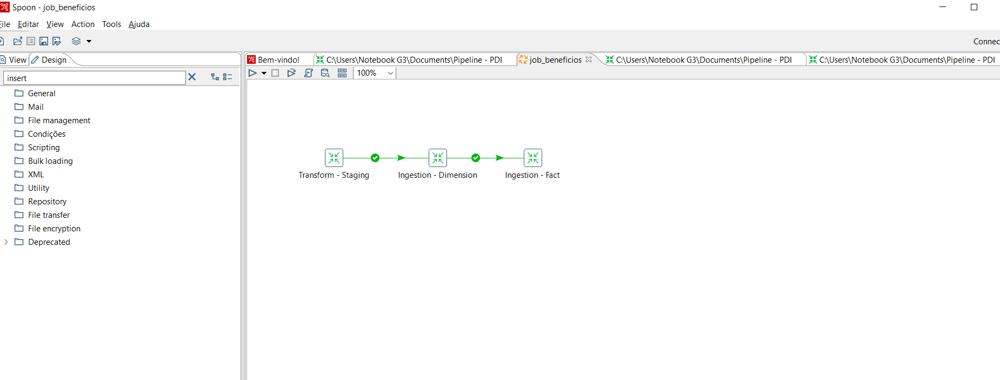
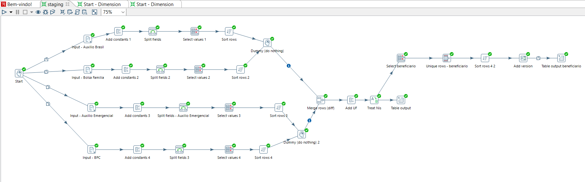
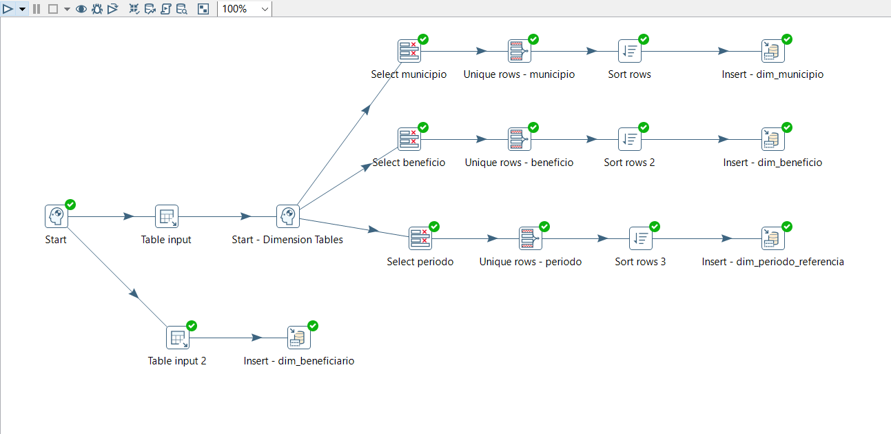
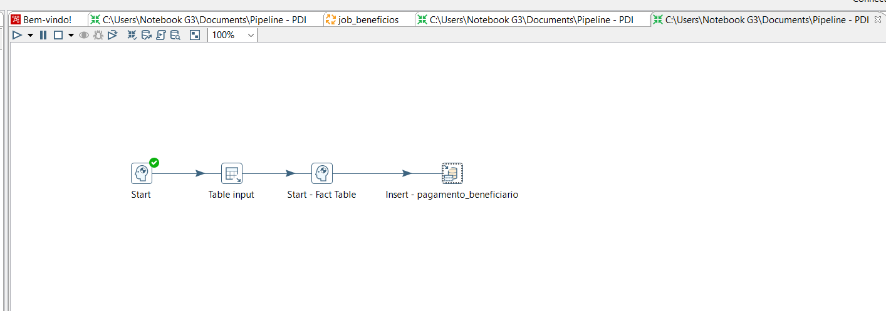

# Documentação Pipeline

A pipeline desenvolvida para viabilizar a ingestão dos dados de Tanguá para um banco de dados relacional pode ser repartida em 3 estágios:
1. "Transform - Staging", responsavel pelo tratamento e validação
2. "Ingestion - Dimension", responsável para popular as tabelas do banco de dados relacional associados as dimensões
3. "Ingestion - Fact", responsável para popular a tabela fato, em função dos dados já populados nas tabelas de dimensões

## Transform - Staging

A partir do estágio de Staging, o dataset é divido em função dos benefícios para cada agrupamento receber o tratamento adequado. 

## Ingestion - Dimension

No estágio de ingestão, é uma consulta para extrair apenas os dados do beneficiarios e inseri-los na tabela dimensão "dim_beneficiario". E para realizar as demais ingestões, é feito uma consulta em função dos dados referentes a cada dimensão e um breve tratamento na consulta gerada antes de inserido nas respectivas tabelas. 
1. Para a tabela dimensão "dim_municipio", os dados do municipio de Tanguá foram consultas, as duplicatas foram eliminadas  e a consulta resultante foi inserida na tabela no banco relacional
2. Para a tabela beneficio ''dim_beneficio", os dados referentes aos beneficios (BPC, Auxilio Emergencial, Bolsa Famila, Auxilio Brasil) foram consultadas, as duplicatas foram descartadas e a consulta resultante foi inserida na tabela do banco relacional
3. Para a tabela beneficio ''periodo", os dados referentes aos pares de mês e ano em que foram efetuados pagamentos para os beneficiarios foram consultadas, as duplicatas foram descartadas e a consulta resultante foi inserida na tabela do banco relacional

## Ingestion - Fact

Diante dos dados brutos, no estágio de ingestão da tabela fato, é feito a associação dos dados já inserido para poder estruturar as relações das dimensões

